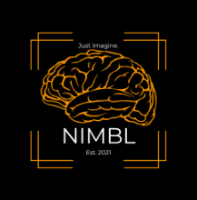

<p align="center">
  
</p>

The Neuroplasticity, Imagery, and Motor Behaviour Laboratory (NIMBL) is
dedicated to research in the areas of motor learning and stroke-related
neuroscience, encompassing both basic and applied neuroscience. Our overarching
goal is to improve motor learning and relearning after brain injury. Basic work
focuses on understanding brain function and plasticity associated with motor
learning through non-physical forms of practice (imagined practice and action
observation). Applied work focuses on informing, developing, and testing
interventions using non-physical forms of practice, and tools to aid such
practice, to promote recovery after stroke.

The NIMBL is funded by the Natural Sciences and Engineering Research Council of
Canada (NSERC), and the Canadian Foundation for Innovation (CFI).

## The task

A touchscreen experiment for a motor-overflow study, written in Python with
pygame. Participants tap back and forth between an X and a target on a Surface
Pro to a 40 bpm metronome, in four conditions: actually moving (ME), watching a
video of someone moving (AO), and imagining the movement kinaesthetically (KMI)
or visually (VMI). ME always runs first; the other three are counterbalanced by
participant number.

While the task runs, EMG is recorded on a separate PC with a CED Micro1401
and Spike2. The two machines are kept in sync by digital markers driven by a
Black Box Toolkit USB TTL module into the 1401's rear digital connector:
three per trial (finger on the X, trial clock starts, closing bell), recorded
on a Digital Marker channel. Each condition is four blocks of 8 trials, one
target size per block (Small, Large, Small, Large or the reverse,
counterbalanced), and each block is recorded to its own Spike2 file, 16 per
session. The straight cable supplied with the BBTK carries only the strobe,
so every marker reads `AA`; a Spike2 script then labels each file's 8 trials
`1a 1b 1c … 8c` by their 2.2 s / 15 s spacing.

## What's in here

| File | What it is |
| --- | --- |
| `motor_overflow9.py` | The full study: sign-in, handedness, reach calibration, the four conditions (4 blocks of 8 trials each), MAAS and NASA-TLX questionnaires. This is the one you run. |
| `bbtk_trigger.py` | The trigger link to the BBTK module. Also decodes a block's recorded marker times back into trials (`py bbtk_trigger.py decode <file>`). |
| `trigger_test.py` | Bench tool for checking the cable and Spike2 without running the task. |
| `spike2/` | Spike2 sampling configuration and the script that labels the markers after a session. |
| `CHEAT_SHEET.md` | Copy-paste cheat sheet for the lab machine. |
| `SETUP_INSTRUCTIONS.md` | Cabling and setup walk-through. |
| `Py-Spike2 Trigger.docx` | Write-up of the Python-to-Spike2 trigger setup. |
| `nimbl_logo.png`, `bell.wav` | The logo on the welcome screen and the trial bell. Both optional: the task runs without them. |


## Running it

```
py -m pip install pygame-ce pyserial opencv-python
py motor_overflow9.py
```

The first screen checks the trigger. It should say `BBTK answered on COMn`.
If you don't have the hardware plugged in, set `MO_TRIGGER_MOCK=1` and it
will run against a fake port instead.

Touch handling talks to Windows directly (to reject palms and oversized
contacts), so this only runs on Windows.

## Output

Everything a participant does is written to CSV under `mo_*` folders next to
the script: initialisation, calibration, session order, per-trial touch logs,
the Spike2 file each trial belongs in, and questionnaire answers. Those folders are
`.gitignore`d because they're data, not code. So are the AO stimulus videos,
which live on each lab machine.

## Wiring, in short

The straight DB25 cable supplied with the BBTK goes into the Micro1401's
rear Digital Inputs connector. Only the strobe (BBTK line 8) reaches the
1401, so markers arrive as `AA` and the script labels them by spacing.
In Spike2, Trig is a Digital Marker channel (channel 32). Set the COM port's
latency timer to 1 ms in Device Manager or the markers arrive late.
`SETUP_INSTRUCTIONS.md` has the pin table and the step-by-step checks.
